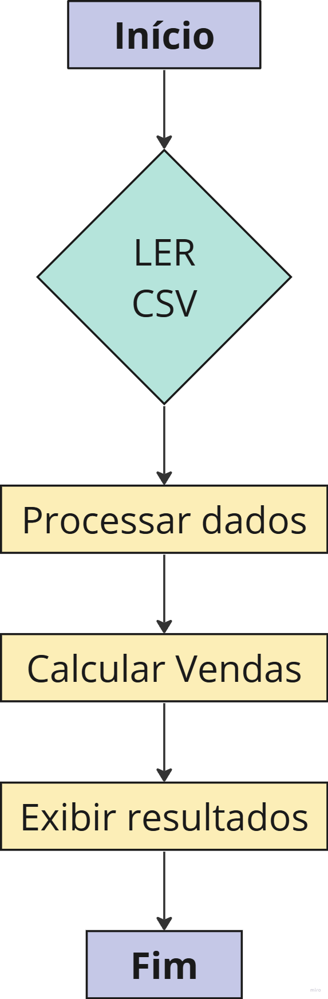

# Pipeline de ETL simples

 Como parte da minha jornada de aprendizado em Engenharia de Dados, enfrentei o desafio de desenvolver um processo de ETL (Extração, Transformação e Carga) simples, mas que envolvia diversos conceitos de base. Neste Readme, vou compartilhar um pouco sobre essa experiência e as lições que aprendi.

##  🌟 **Contexto do Negócio**
O projeto envolveu dados de vendas diárias fornecidos por uma API de um e-commerce (nesse caso de estudo, eu já estava com os .json tratados e disponíveis). 

##  🎯 **Qual o desafio?**

Criar uma ETL simples para ler arquivos do tipo Json, concatenar diversos esses arquivos, fazer algumas transformação nos dados e ao final, poder ter escolher entre duas saídas, um .csv ou um .parquet

##  🛤️ Passos Cruciais do Projeto

### 1. Desenhar o Fluxo da Solução:

** As tarefas são as seguintes:**
1. Ler arquivos JSON.
2. Concatenar vários arquivos JSON.
3. Transformar os dados usando a biblioteca Pandas.
4. Exportar os dados transformados em CSV ou Parquet.

** Com o fluxo acima, é possível:**

-  Entender o fluxo de dados desde a extração, transformação até a carga dos dados.
- Mapeamento dos pontos de integração e transformações necessárias.

###  2. Leitura de Arquivos JSON:

- Analisar a melhor abordagem para leitura dos arquivos
- Decidir entre utilizar Python puro ou bibliotecas especializadas.
    - Nesse caso, optei por utilizar a biblioteca pandas pois já é  amplamenta aceita e utiliza comercialmente.

###  3. Transformações nos dados:

- Realizar as transformações necessárias nos dados, como limpeza, agregação e conversões.
- Garantir a qualidade dos dados utilizando ferramentas como Pydantic e Pandera para validações e consistência.

##  📚 **Conceitos Fundamentais Aprendidos**
**ETL:** Compreensão profunda de cada fase do processo ETL e sua importância na integração de dados.
**  Qualidade de Dados:** Validação rigorosa da integridade dos dados ao longo do pipeline.
**  Ferramentas:** Uso estratégico de Pandas, Pydantic e Pandera, entendendo a escolha da ferramenta certa para cada etapa.

##  **🚀 Próximos Passos**
**Aprimoramento:** Otimizar o pipeline com novas ferramentas e técnicas para melhorar a escalabilidade e o desempenho.
**  Exploração:** Aplicar os conhecimentos adquiridos em projetos mais complexos, continuando a expandir meu domínio em Engenharia de Dados.